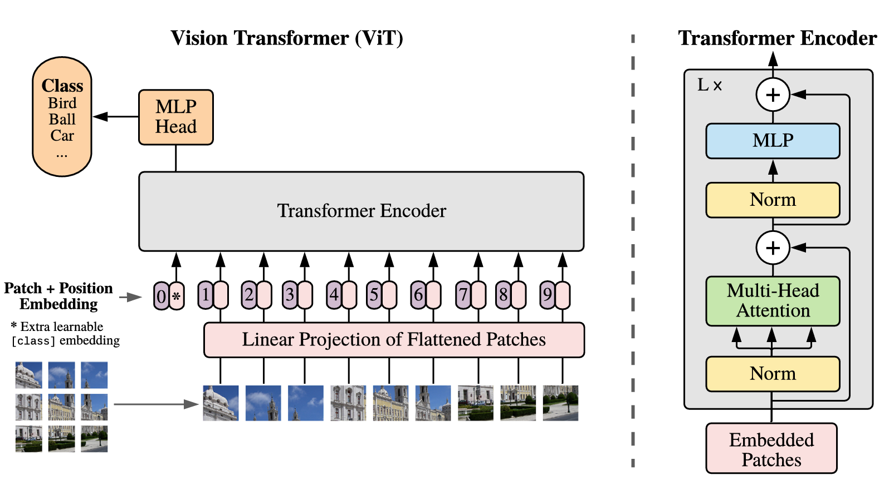

[📖中文 ReadMe](./README_zh.md)
## Introduction
This project demonstrates how to load the official pre-trained weights from [Huggingface](https://huggingface.co/google/vit-base-patch16-224) into a Vision Transformer (ViT) model and fine-tune it on the CIFAR10 dataset. The experimental results are replicated from the original paper, [An Image is Worth 16x16 Words: Transformers for Image Recognition at Scale](https://arxiv.org/pdf/2010.11929). Note that I have not implemented the complete training process. While the pre-training and fine-tuning setups differ, fully replicating the results is challenging due to the large scale of the ImageNet and JFT-300M datasets.

## Model Details
### Key Differences from the Original Transformer
1. ViT only utilizes the Encoder component of the original Transformer model.
2. A convolutional layer is applied to the input image before passing it through the ViT model.
3. A classification token (cls token) is added to each input image, similar to BERT's approach.
4. In the ViT Encoder, the feedforward neural network omits dropout and replaces the ReLU activation function with GeLU.
5. Layer normalization (LayerNorm) is applied to both the input and output of the self-attention mechanism in ViT.
6. Learnable positional embeddings are used in ViT, replacing the traditional sine-cosine positional encodings.

### [An Image is Worth 16x16 Words](./modules/layers.py)
In ViT, an image (e.g., 224x224) is divided into 14x14 patches of size 16x16. After passing through a convolutional layer, each patch becomes a vector, resulting in 14x14 vectors—each similar to a token embedding in natural language. This is the core concept of ViT: **an image is worth 16x16 words**.

ViT is conceptually similar to BERT, as both models use a Transformer Encoder for feature extraction and introduce a classification token. This token aggregates the image information when the image is input, and it is typically used for downstream tasks such as image classification.

<center>
    
    <br>
    <div>
      ViT Structure (left) and ViT Encoder (right)
  	</div>
</center>

### Positional Embedding
Like GPT and BERT, ViT does not use traditional sine-cosine positional encodings but instead employs learnable positional embeddings. Despite the intuition that 2D positional embeddings might be more suitable, experiments show that the performance differences between 1D, 2D, and relative positional embeddings are minimal, with 1D embeddings slightly outperforming the others.

As the input image size increases, the input sequence becomes longer. Positional embeddings are first interpolated into 2D via bilinear interpolation, then flattened and added to the token embeddings. Notably, the positional embedding of the cls token is excluded from this interpolation process.

## Pre-training
ViT offers several variants, such as ViT-B/16, ViT-B/32 with different patch sizes, and ViT-B, ViT-L, ViT-H with different model sizes. These models are pre-trained on the ImageNet1k, ImageNet21k, and JFT-300M datasets. The Adam optimizer is used with a batch size of 4096, a warm-up period of 10k steps, and an image resolution of 224. For further details, please refer to Appendix B of the original paper.

## [Fine-tuning](./finetune.ipynb)
After pre-training on ImageNet1k, ImageNet21k, and JFT-300M, the model was further fine-tuned on datasets such as CIFAR

10, CIFAR100, and Oxford-IIIT-Pets. For simplicity, this project focuses on fine-tuning the model on CIFAR10.

Following the settings from Appendix B.1.1, the SGD optimizer is used with a momentum of 0.9, gradient clipping norm of 1, no weight decay, and an image resolution of 384. The training set’s 2% is used as a validation set, and the learning rate is scanned within the range `[0.001, 0.003, 0.01, 0.03]` to select the best value. Then, the model is trained for 7 epochs on the full training set using this learning rate. Importantly, the classifier uses a matrix initialized with zeros, rather than a linear layer with a bias term.

## Appendix
### How to Download Pretrained ViT?
To download the pre-trained ViT model, execute the following command:
```bash
pip install -U huggingface-cli
export HF_ENDPOINT=https://hf-mirror.com
huggingface-cli download google/vit-base-patch16-224 --local-dir path/to/pretrained_dir
```