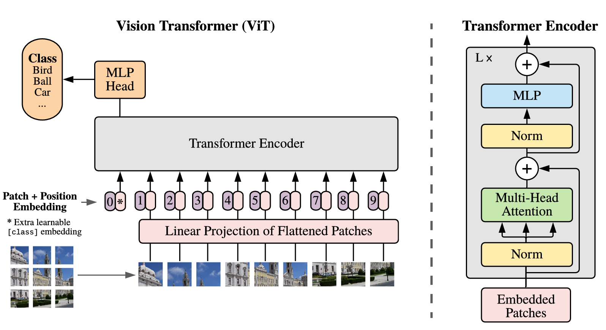

[📖 English ReadMe](./README.md)  
## Introduction  
在本项目中，我展示了如何将 [huggingface](https://huggingface.co/google/vit-base-patch16-224) 上的官方预训练权重加载到 Vision Transformer (ViT) 模型中，并在 CIFAR10 数据集上进行微调，复现原始论文 [An Image is Worth 16x16 Words: Transformers for Image Recognition at Scale](https://arxiv.org/pdf/2010.11929) 中的实验效果。请注意，我没有实现完整的训练过程，虽然预训练和微调设置有所不同，但由于 ImageNet 和 JFT-300M 数据集规模过大，难以完全复现。

## Model Details  
### Key Differences from Vanilla Transformer
1. ViT 只使用了原始 Transformer 的 Encoder。
2. ViT 在输入图像前应用卷积层。
3. ViT 向每个输入图像添加一个 cls token，与 BERT 相似。
4. 在 ViT 的 Encoder 层中，前馈神经网络去除了 dropout，并将激活函数从 ReLU 替换为 GeLU。
5. ViT 在 self-attention 的输入和输出上添加了 `LayerNorm`。
6. ViT 使用可学习的位置嵌入，代替了正余弦位置编码。

### [An Image is Worth 16x16 Words](./modules/layers.py)  
在 ViT 中，一张图像（例如 224x224）被划分为 14x14 个 16x16 的块。每个块经过卷积后，形成 14x14 个向量，每个向量类似于自然语言中的一个 token embedding，这是 ViT 的核心理念：**an image is worth 16x16 words**。

ViT 更接近 BERT，二者都使用 Transformer Encoder 提取特征，因此也添加了 cls token。该 token 在输入图像时会被插入，汇聚图像信息。在下游任务（如图像分类）中，通常只使用该 cls token 的信息。

<center>
    
    <br>
    <div>
      ViT 结构（左）与 ViT Encoder（右）
  	</div>
</center>

### Positional Embedding  
与 GPT 和 BERT 等模型类似，ViT 不使用正余弦位置编码，而是采用可学习的位置嵌入。尽管直觉上 2D 位置嵌入可能更为合适，实验表明，1D、2D 和相对位置嵌入的效果相差无几，且 1D 嵌入稍微表现更好。

当输入图像的尺寸增大时，输入序列变长，位置嵌入会先通过双线性插值转为 2D，再展平并与 token embeddings 相加。值得注意的是，cls token 的位置嵌入不参与插值过程。

## Pre-training  
ViT 提供多种变体，如不同 patch 大小的 ViT-B/16、ViT-B/32，以及不同模型规模的 ViT-B、ViT-L、ViT-H。这些模型在 ImageNet1k、ImageNet21k 和 JFT-300M 数据集上进行预训练，优化器采用 Adam，batch size 为 4096，warmup 步数为 10k，图像分辨率为 224。更多细节请参考原论文附录 B。

## [Fine-tuning](./finetune.ipynb)  
在 ImageNet1k、ImageNet21k 和 JFT-300M 上预训练后，作者还在 CIFAR10、CIFAR100、Oxford-IIIT-Pets 等数据集上进行了微调。为了简化，本项目在 CIFAR10 上进行了微调。

根据论文 B.1.1 设置，使用 SGD 优化器，momentum 为 0.9，gradient clipping norm 为 1，不使用 weight decay，图像分辨率设为 384。首先使用训练集的 2% 作为验证集，在 `[0.001, 0.003, 0.01, 0.03]` 范围内扫描学习率，并选择最佳值。然后，在整个训练集上使用该学习率进行 7 轮训练。需要注意的是，分类器使用的是零初始化的矩阵，而非带有偏置的线性层。

## Appendix  
### How to Download Pretrained ViT?  
运行以下命令下载预训练的 ViT 模型：  
```bash  
pip install -U huggingface-cli  
export HF_ENDPOINT=https://hf-mirror.com  
huggingface-cli download google/vit-base-patch16-224 --local-dir path/to/pretrained_dir  
``` 
